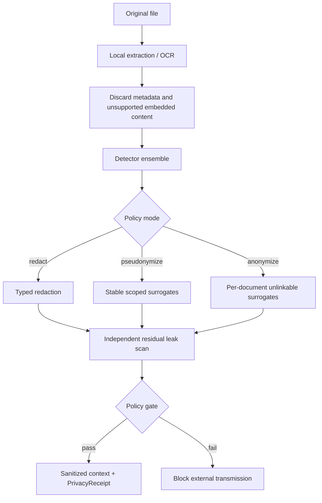

# Context Governance Protocol (CGP)

> **Governed context infrastructure for AI systems.**  
> Private by default. Policy-bound. Provable.

[](#project-status)
[](go.mod)
[](LICENSE)

**Context Governance Protocol (CGP)** is an experimental, model-agnostic protocol and runtime for deciding:

- what an AI system is allowed to know;
- which context is actually necessary for a task;
- how sensitive context must be transformed;
- where that context may be processed;
- which policies and human controls apply;
- how every decision can be reconstructed later.

The three words describe the project directly:

- **Context** — the governed asset delivered to the model;
- **Governance** — privacy, security, purpose, trust, jurisdiction and evidence;
- **Protocol** — an interoperable contract across applications, agents and providers.

> **Project status:** pre-alpha. The core protocol, local privacy gateway and baseline conformance runner exist as reference implementations. Provider routing, the Context Trust Firewall, EU policy compilation and zero-config proxy integration remain roadmap work.

## The problem

AI applications can connect models to more tools and data than ever, but the rules that decide what reaches the model are usually scattered across prompts, retrieval code, vector filters, provider settings, security middleware and compliance documents.

This produces predictable failures:

- entire documents are sent when only a few passages are relevant;
- personal data, credentials and internal identifiers reach external providers;
- stale or untrusted data is mixed with authoritative instructions;
- data is reused for purposes for which it was not collected;
- region, retention and training-use constraints are not enforced at runtime;
- no one can reconstruct which context, model, policy and permissions produced a result.

CGP moves these decisions into a portable context layer.

## Architecture


CGP is designed as three interoperable layers:

1. **Protocol** — context requests, plans, nodes, policies and receipts.
2. **Gateway** — a local or sidecar runtime for sanitization, planning, trust, policy and routing.
3. **Evidence** — portable records that explain what happened without disclosing original sensitive values.

## Context Contract

Instead of sending an arbitrary prompt dump, a consumer declares an explicit contract:

```json
{
  "intent": { "type": "legal-document-summary" },
  "budget": {
    "maxTokens": 8000,
    "maxBytes": 524288,
    "maxLatencyMs": 100
  },
  "requirements": {
    "freshnessMs": 5000,
    "minimumConfidence": 0.85,
    "includeProvenance": true,
    "acceptSensitivity": ["public", "internal", "sanitized"]
  },
  "knownContext": ["sha256:already-cached-node"]
}
```

The provider returns a ranked **Context Plan**, not an unbounded document dump.

## Local Privacy Gateway



The current reference implementation supports text, OpenXML documents, local PDF extraction and local OCR adapters. Reversible pseudonymization uses a local AES-256-GCM encrypted vault.

Automated anonymization reduces exposure but is not an unconditional legal guarantee. Quasi-identifiers and contextual re-identification still require domain-specific evaluation.

## CGP and MCP

CGP is not a replacement for MCP tool and resource connectivity. It can consume MCP resources and govern the context compiled from them.

| Concern | MCP | CGP |
|---|---|---|
| Primary purpose | Connect models to tools and resources | Govern, optimize and prove context delivery |
| Tool execution | Core concern | Outside the protocol core |
| Resource discovery | Yes | Can consume it |
| Token/byte/latency contract | Host-defined | Protocol primitive |
| Local anonymization | Not a core responsibility | First-class gateway |
| Purpose and jurisdiction | Application responsibility | Governance target |
| Receipts | Implementation-specific | Core evidence abstraction |

**MCP asks:** What is available?  
**CGP asks:** What is the minimum safe and authorized context this model should receive now?

## Enforcement vocabulary

CGP targets five deterministic decisions:

```text
ALLOW
SANITIZE
ROUTE_LOCAL
REQUIRE_HUMAN
DENY
```

## Quick start

```bash
git clone https://github.com/MrQwenty/fast-context-protocol.git
cd fast-context-protocol

go test -race ./...
go vet ./...
```

Run the reference provider:

```bash
go run ./cmd/fcpd -listen :8080 -catalog examples/basic-provider/context.json
```

Resolve context:

```bash
go run ./cmd/fcpctl \
  -endpoint http://localhost:8080 \
  -intent code.review \
  -target pull-request:482 \
  -max-tokens 4000
```

Sanitize a document locally:

```bash
go run ./cmd/fcpprivacy \
  -input examples/privacy/sample.txt \
  -output /tmp/sample.sanitized.txt \
  -report /tmp/sample.privacy.json \
  -mode anonymize
```

Validate a provider:

```bash
go run ./cmd/fcpconform -endpoint http://localhost:8080
```

## Documentation website

The framework-style landing and documentation source lives in [`website/`](website/). It includes architecture, concepts, privacy, governance, security, integrations, API reference, project status and roadmap documentation.

The included GitHub Pages workflow builds and publishes the static site after Pages is configured to use **GitHub Actions**.

## Compatibility naming

The implementation was initially developed under the Fast Context Protocol namespace. During pre-alpha, existing interfaces remain valid:

```text
Repository          fast-context-protocol
Wire paths          /fcp/v0.1/...
Discovery           /.well-known/fcp
Header              FCP-Version
Media type          application/fcp+json
Binaries            fcpd, fcpctl, fcpconform, fcpprivacy
Specifications      FCP-NNNN
```

Future `cgp` aliases will be introduced additively and verified through conformance tests before any deprecation is considered.

## EU governance direction

CGP is designed as a **compliance accelerator and evidence system**, not an automatic certification service. Planned capabilities include AI Act use-case classification support, transparency payloads, meaningful human oversight, GDPR purpose binding, retention and deletion propagation, EU-only routing, signed policy packs, AI Bill of Materials and audit export.

Applicability depends on the organization, role, use case, sector, jurisdiction, contracts and actual operational controls. Qualified legal and compliance review remains necessary.

## Project status

Implemented or experimentally implemented:

- discovery, resolution and Context Plans;
- token and byte budgets;
- content-addressed nodes;
- inline, reference and fetch delivery;
- receipt ingestion;
- baseline conformance runner;
- local document extraction and privacy transformation;
- redaction, pseudonymization and per-document anonymization;
- encrypted reversible mapping vault;
- residual leak scan and fail-closed policy gate.

Planned:

- resumable priority streaming and delta updates;
- MCP and provider adapters;
- zero-config OpenAI-compatible proxy;
- Context Trust Firewall and taint tracking;
- provider routing by region, retention and training use;
- signed regulatory policy packs;
- purpose, retention and data-rights propagation;
- SDKs and reproducible performance/privacy benchmarks.

See [`ROADMAP.md`](ROADMAP.md), [`docs/NAMING.md`](docs/NAMING.md) and [`docs/spec/`](docs/spec/).

## Open-source direction

The recommended model is an **open protocol and reference core with commercial governance services**. Specifications, schemas, conformance tests, SDKs and the reference gateway should remain auditable. Managed policy updates, sector packs, enterprise administration, evidence retention, certified connectors, confidential routing and support can form the commercial layer.

## License

Apache License 2.0. See [`LICENSE`](LICENSE).
