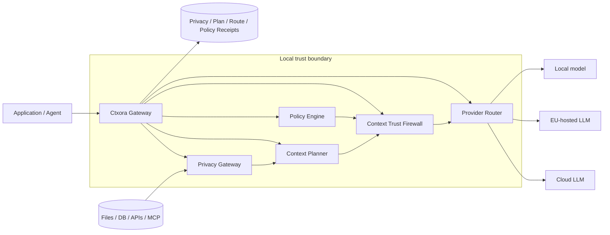
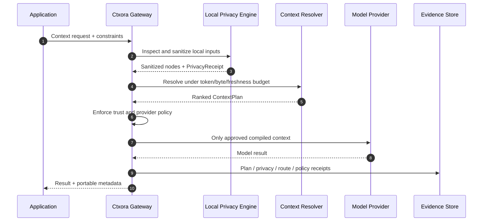
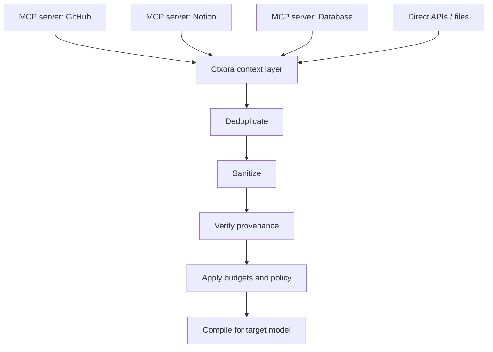
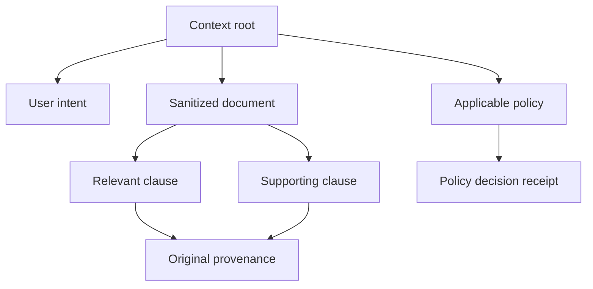
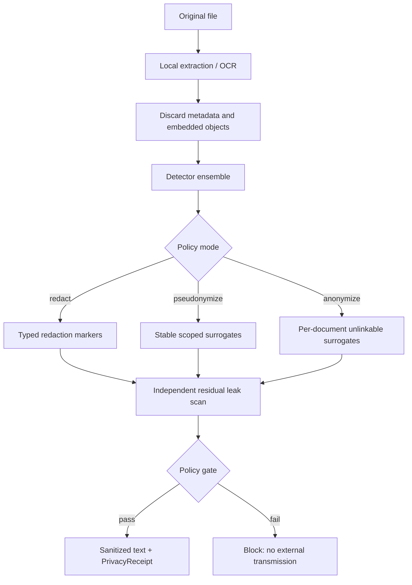
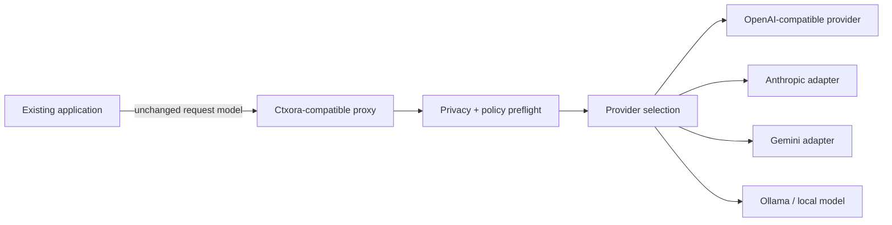

# Ctxora

> **Governed context infrastructure for AI systems.**  
> Fast context. Private by default. Policy-bound. Provable.

[](#project-status)
[](go.mod)
[](LICENSE)

**Ctxora** is the working public name for the project originally called **Fast Context Protocol (FCP)**.

Ctxora is an experimental, model-agnostic protocol and runtime for discovering, selecting, sanitizing, transporting, updating, and proving the context used by AI systems under explicit constraints for:

- latency;
- token and byte budgets;
- freshness;
- provenance;
- privacy;
- security;
- purpose;
- jurisdiction;
- human oversight;
- regulatory evidence.

The current source tree and wire namespace still use `fcp` for backward compatibility while the project is pre-alpha. A future versioned migration will introduce the `ctxora` command and protocol namespace without silently breaking existing clients.

> **Project status:** pre-alpha. The core protocol and local privacy gateway are implemented as reference code. Advanced governance, EU policy compilation, provider routing, trust-firewall, and zero-config proxy capabilities are active roadmap work. APIs and wire formats may change.

---

## The problem

AI applications can connect to more tools and data than ever, but they still lack a standard answer to a more important question:

> **What exactly should the model be allowed to know for this operation, how should that context be transformed, and how can the result be proven later?**

Typical AI pipelines currently leave this logic scattered across:

- prompts;
- application code;
- retrieval pipelines;
- vector database filters;
- provider settings;
- security middleware;
- compliance documents;
- manual review procedures.

That creates predictable failures:

- entire documents are sent when only a few passages are needed;
- personal data and secrets reach external providers;
- stale or untrusted context is mixed with authoritative instructions;
- the same data is reused for a purpose it was never collected for;
- provider region, retention, and training policies are not enforced at runtime;
- no one can reconstruct which sources, model, policy, and permissions produced a result.

Ctxora moves those decisions into a portable context layer.

---

## What Ctxora is

Ctxora is designed as three interoperable parts:

1. **Protocol** — a model-agnostic contract for context requests, plans, nodes, policies, and receipts.
2. **Gateway** — a local or sidecar runtime that sanitizes, plans, routes, and enforces policy before inference.
3. **Evidence layer** — cryptographic and machine-readable receipts that explain what happened without exposing the original sensitive values.



The reference repository currently implements the core planning protocol, local privacy processing, and baseline conformance checks. The policy engine, trust firewall, and multi-provider router in the diagram are the target architecture and are tracked explicitly in the roadmap.

---

## The central idea: a Context Contract

Instead of sending arbitrary text to a model, the consumer declares a **Context Contract**.

```json
{
  "requestId": "req_01K...",
  "intent": {
    "type": "legal-document-summary",
    "target": "document:contract-42"
  },
  "consumer": {
    "modelFamily": "generic",
    "contextWindow": 128000,
    "modalities": ["text"]
  },
  "budget": {
    "maxTokens": 8000,
    "maxBytes": 524288,
    "maxLatencyMs": 100
  },
  "requirements": {
    "freshnessMs": 5000,
    "minimumConfidence": 0.85,
    "includeProvenance": true,
    "acceptSensitivity": ["public", "internal", "sanitized"]
  },
  "knownContext": [
    "sha256:already-cached-node"
  ]
}
```

A provider returns a **Context Plan**, not an unbounded document dump.

```json
{
  "requestId": "req_01K...",
  "planId": "plan_01K...",
  "protocolVersion": "0.1",
  "contextRoot": "sha256:root...",
  "complete": true,
  "estimatedTokens": 6240,
  "estimatedBytes": 182400,
  "estimatedLatencyMs": 34,
  "chunks": [
    {
      "rank": 1,
      "delivery": "inline",
      "score": 0.98,
      "reason": "required for the requested intent",
      "node": {
        "id": "sha256:...",
        "type": "document.clause",
        "contentType": "text/plain",
        "tokenEstimate": 830,
        "priority": 1,
        "confidence": 0.97,
        "sensitivity": "sanitized"
      }
    }
  ]
}
```

The contract makes context selection measurable and enforceable rather than implicit.

---

## How a request flows



The intended enforcement decisions are deliberately small and predictable:

```text
ALLOW
SANITIZE
ROUTE_LOCAL
REQUIRE_HUMAN
DENY
```

---

## Why this is different from MCP

Ctxora is not designed to compete with MCP as a tool-connection protocol. It can consume MCP resources and sit above or beside MCP.



| Concern | MCP | Ctxora |
|---|---|---|
| Primary purpose | Connect models to tools and resources | Govern, optimize, and prove context delivery |
| Tool execution | Core concern | Deliberately out of scope for the core |
| Resource discovery | Yes | Can consume it |
| Token/byte/latency contract | Application-defined | Protocol-level primitive |
| Context graph | Host-specific | Content-addressed nodes and relationships |
| Local anonymization | Not a core protocol responsibility | First-class privacy gateway |
| Context provenance | Resource metadata | End-to-end context evidence |
| Cross-provider composition | Host responsibility | Target protocol primitive |
| Purpose and jurisdiction enforcement | Application responsibility | Target policy primitive |
| Context receipts | Not the central abstraction | Core feedback and evidence mechanism |

**MCP answers:** “What tools and resources are available?”  
**Ctxora answers:** “What is the smallest safe and authorized context this model should receive now?”

---

## Content-addressed Context Graph

Ctxora treats context as typed, immutable, content-addressed nodes instead of a bag of prompt strings.



Each node can carry:

- SHA-256 identity;
- type and media type;
- byte and token estimates;
- priority and confidence;
- freshness deadline;
- sensitivity;
- provenance;
- relationships;
- relevant intents and targets;
- privacy transformation state.

This enables:

- deterministic cache reuse;
- deduplication;
- integrity validation;
- selective fetch;
- future delta updates;
- dependency-aware deletion;
- reproducible context plans.

---

## Local Privacy Gateway

Sensitive content should be transformed **before** it reaches an external model, provider, vector store, telemetry system, or remote log.



### Supported modes

- **`redact`** — replaces detected values with typed markers.
- **`pseudonymize`** — creates stable surrogates inside a declared scope.
- **`anonymize`** — creates per-document unlinkable surrogates without retaining a re-identification mapping.

### Supported inputs

The reference implementation can process:

- UTF-8 text, Markdown, CSV, JSON, XML, YAML, and HTML;
- DOCX, PPTX, and XLSX through local OpenXML inspection;
- PDF through a local `pdftotext` adapter;
- images through local `tesseract` OCR.

Unsupported or insufficiently inspectable documents fail closed when fail-closed mode is enabled.

### Privacy Receipt

A transformation produces a receipt that contains evidence, not the original values:

```json
{
  "receiptId": "privacy:...",
  "mode": "anonymize",
  "inputDigest": "sha256:...",
  "outputDigest": "sha256:...",
  "processor": "fcp-local-privacy-gateway",
  "localOnly": true,
  "detected": 12,
  "transformed": 12,
  "unresolved": 0,
  "residualRisk": 0,
  "passed": true
}
```

Automated anonymization reduces exposure but must not be represented as an unconditional legal guarantee. Contextual and quasi-identifier re-identification risk still requires domain-specific evaluation.

---

## Zero-config integration target

The target developer experience is intentionally minimal:

```bash
ctxora init --profile eu-safe
ctxora run -- python app.py
```

For OpenAI-compatible applications, the target is a base-URL-only integration:

```bash
export OPENAI_BASE_URL=http://127.0.0.1:8787/v1
python app.py
```



This proxy and provider-routing layer is planned work. It is not yet part of the implemented reference runtime.

---

## EU governance direction

Ctxora is being designed as a **compliance accelerator and evidence system**, not an automatic legal certification service.

The target EU governance layer will compile declared use-case information into deterministic runtime decisions and evidence gaps:

```yaml
profile: eu-safe

privacy:
  mode: anonymize
  fail_closed: true

providers:
  processing_region: eu-only
  retention: zero
  training_use: deny
  local_fallback: true

governance:
  classify_ai_act: true
  transparency_marking: true
  human_review: automatic
  audit_receipts: true
```

Planned governance primitives include:

- AI Act role and risk classification support;
- prohibited-practice preflight;
- transparency payloads;
- meaningful human-oversight requirements;
- GDPR purpose and legal-basis binding;
- retention, restriction, objection, and deletion propagation;
- EU/EEA provider-routing constraints;
- no-training and zero-retention requirements;
- signed, versioned regulatory policy packs;
- AI Bill of Materials;
- audit and incident evidence export;
- compliance simulation in CI.

The EU AI Act is Regulation (EU) 2024/1689 and has a staged application timeline. GDPR requirements remain independently applicable where personal data is processed. Pseudonymization and anonymization are not interchangeable.

Official references:

- [EU Artificial Intelligence Act — Regulation (EU) 2024/1689](https://eur-lex.europa.eu/eli/reg/2024/1689/oj/eng)
- [GDPR — Regulation (EU) 2016/679](https://eur-lex.europa.eu/eli/reg/2016/679/oj/eng)
- [European Commission AI Act policy portal](https://digital-strategy.ec.europa.eu/en/policies/regulatory-framework-ai)
- [EDPB guidance topic: anonymisation and pseudonymisation](https://www.edpb.europa.eu/topics/ai-and-technology/anonymisation-pseudonymisation_en)
- [NIS2 Directive — Directive (EU) 2022/2555](https://eur-lex.europa.eu/eli/dir/2022/2555/oj/eng)
- [Cyber Resilience Act — Regulation (EU) 2024/2847](https://eur-lex.europa.eu/eli/reg/2024/2847/oj/eng)

> Ctxora cannot determine legal compliance from technical telemetry alone. Applicability depends on the organization, role, use case, sector, jurisdiction, contracts, and actual operational controls. Qualified legal and compliance review remains necessary.

---

## Quick start

### Requirements

- Go 1.23 or newer;
- optional `pdftotext` for local PDF extraction;
- optional `tesseract` for local image OCR.

### Clone and validate

```bash
git clone https://github.com/MrQwenty/fast-context-protocol.git
cd fast-context-protocol

go test -race ./...
go vet ./...
```

### Run the reference provider

```bash
go run ./cmd/fcpd \
  -listen :8080 \
  -catalog examples/basic-provider/context.json
```

### Resolve context

```bash
go run ./cmd/fcpctl \
  -endpoint http://localhost:8080 \
  -intent code.review \
  -target pull-request:482 \
  -max-tokens 4000 \
  -max-latency-ms 80
```

### Sanitize a document locally

```bash
go run ./cmd/fcpprivacy \
  -input examples/privacy/sample.txt \
  -output /tmp/sample.sanitized.txt \
  -report /tmp/sample.privacy.json \
  -custom-terms examples/privacy/custom-terms.txt \
  -mode anonymize
```

### Stable pseudonymization

```bash
export FCP_PRIVACY_SECRET='replace-with-at-least-16-random-bytes'

go run ./cmd/fcpprivacy \
  -input contract.docx \
  -output contract.sanitized.txt \
  -report contract.privacy.json \
  -mode pseudonymize \
  -scope workspace-42
```

Reversible pseudonymization additionally requires:

- `-reversible`;
- a local `-vault` path;
- `FCP_PRIVACY_VAULT_KEY`.

The mapping vault is encrypted with AES-256-GCM and must remain outside model context.

### Validate a provider

```bash
go run ./cmd/fcpconform \
  -endpoint http://localhost:8080
```

The conformance runner emits a machine-readable report and exits non-zero when baseline discovery, version negotiation, budget enforcement, or error semantics fail.

---

## Current HTTP baseline

The reference provider exposes:

| Method | Path | Purpose |
|---|---|---|
| `GET` | `/.well-known/fcp` | capability and endpoint discovery |
| `POST` | `/fcp/v0.1/context/resolve` | resolve a request into a Context Plan |
| `GET` | `/fcp/v0.1/context/{sha256:digest}` | fetch an authorized node |
| `POST` | `/fcp/v0.1/receipts` | submit a delivery/outcome receipt |
| `GET` | `/healthz` | health check |

Current media types and headers:

```text
Content-Type: application/fcp+json
FCP-Version: 0.1
```

These names are retained during the pre-alpha naming transition.

---

## Feature status

| Capability | Status |
|---|---|
| Discovery document | Implemented |
| Context requests and plans | Implemented |
| Token and byte budgets | Implemented |
| Latency budget declaration | Implemented baseline |
| Content-addressed nodes | Implemented |
| Inline, reference, and fetch delivery | Implemented |
| Known-context cache reuse | Implemented baseline |
| Delivery receipts | Implemented baseline |
| Provider conformance runner | Implemented baseline |
| Local redaction | Experimental implementation |
| Scoped pseudonymization | Experimental implementation |
| Per-document anonymization | Experimental implementation |
| Encrypted reversible mapping vault | Experimental implementation |
| OpenXML extraction | Experimental implementation |
| Local PDF and image adapters | Experimental implementation |
| Privacy Receipt and residual leak scan | Experimental implementation |
| Progressive priority streaming | Planned |
| Semantic patches and invalidation | Planned |
| Cross-provider plan composition | Planned |
| Signed manifests and receipts | Planned |
| MCP-to-Ctxora adapter | Planned |
| OpenAI-compatible zero-config proxy | Planned |
| EU Compliance Envelope | Planned |
| Signed regulatory policy packs | Planned |
| Context Trust Firewall and taint tracking | Planned |
| Purpose-bound context and deletion propagation | Planned |
| EU-only provider router | Planned |
| Human-oversight and transparency protocol | Planned |
| AI Bill of Materials and evidence export | Planned |
| Compliance simulator | Planned |
| Python and TypeScript SDKs | Planned |

---

## Metrics that matter

Ctxora should only claim superiority where it can be measured.

The benchmark and conformance program is intended to track:

- **TTFC** — Time to First Context;
- **TTUC** — Time to Usable Context;
- planning latency;
- tokens injected;
- bytes transferred;
- cache reuse ratio;
- task quality retained under budget;
- freshness violations;
- provenance coverage;
- privacy leak rate;
- policy decision latency;
- deletion-propagation completeness;
- evidence completeness;
- cost per successful task.

A credible result is not “the protocol is faster” in the abstract. It is:

```text
Equal or better task quality
with fewer tokens,
fewer transferred bytes,
lower usable-context latency,
less sensitive-data exposure,
and stronger provenance coverage.
```

---

## Design principles

1. **Privacy precedes transport.** Raw sensitive documents are processed locally before external inference.
2. **Budget is part of the request.** Context selection must respect explicit token, byte, and latency limits.
3. **Identity is content-based.** Immutable context is addressed by cryptographic digest.
4. **Metadata is first-class.** Provenance, freshness, sensitivity, and transformations travel with content.
5. **Untrusted data cannot grant itself authority.** Retrieved content must not change permissions or policy.
6. **Purpose travels with data.** Context should state why it may be used, not only what it contains.
7. **Reuse beats retransmission.** Known context is referenced instead of repeatedly transferred.
8. **Decisions must be explainable.** Enforcement should return stable reason codes and remediation.
9. **Evidence must be portable.** Receipts should be independently verifiable and vendor-neutral.
10. **Fail closed at trust boundaries.** Unsupported or insufficiently inspected inputs must not be forwarded unchanged.
11. **Interoperability before optimization.** HTTP and JSON establish the baseline before specialized transports.
12. **No false compliance claims.** Technical controls support compliance; they do not replace legal analysis or organizational accountability.

---

## Repository layout

```text
cmd/fcpd/                  Reference context provider
cmd/fcpctl/                Reference command-line client
cmd/fcpconform/            Provider conformance runner
cmd/fcpprivacy/            Local document privacy gateway

internal/protocol/         Wire types and protocol objects
internal/server/           Resolver and HTTP transport
internal/conformance/      Conformance checks
internal/privacy/          Detection, extraction, transformation, vault, leak scan

spec/schema/               Core and privacy JSON Schemas
examples/basic-provider/   Example context catalogue
examples/privacy/          Privacy fixtures and custom dictionaries

docs/spec/FCP-0001.md      Core protocol specification
docs/spec/FCP-0005.md      Local privacy gateway specification
```

---

## Specifications and roadmap RFCs

### Published drafts

- **FCP-0001** — core context protocol and HTTP/JSON baseline.
- **FCP-0005** — local privacy gateway and anonymization receipts.

### Planned specifications

- **FCP-0002** — patch and invalidation semantics.
- **FCP-0006** — EU Compliance Envelope and policy compiler.
- **FCP-0007** — zero-config gateway and drop-in LLM compatibility.
- **FCP-0008** — Context Trust Firewall and taint tracking.
- **FCP-0009** — purpose binding, retention, and data-rights propagation.
- **FCP-0010** — AI Bill of Materials, incident evidence, and regulatory export.
- **FCP-0011** — signed regulatory policy packs.
- **FCP-0012** — transparency marking and human oversight.
- **FCP-0013** — compliance simulator and adversarial preflight.
- **FCP-0014** — EU-only provider routing and confidential inference.
- **FCP-0015** — explainable policy decisions and developer remediation.

The `FCP-NNNN` identifiers remain historical specification identifiers during the naming migration.

---

## Project status

Ctxora is not production-ready as a security or legal compliance boundary.

What is suitable today:

- protocol experimentation;
- context-planning research;
- local privacy-gateway testing;
- benchmark development;
- interoperability discussions;
- controlled internal prototypes.

What requires further hardening:

- multilingual local NER;
- quasi-identifier generalization;
- adversarial re-identification testing;
- sandboxed document parsers;
- signed receipts and key management;
- authorization and multi-tenancy;
- durable deletion propagation;
- policy-pack governance;
- independent security review;
- formal legal review;
- production observability and incident handling.

---

## Naming

**Ctxora** is the recommended working brand because:

- it avoids a generic three-letter protocol acronym;
- `ctx` is familiar shorthand for context to developers;
- it is short enough for a CLI and package namespace;
- it does not restrict the project to transport speed;
- it can cover the protocol, gateway, policy runtime, and evidence ecosystem.

Proposed naming:

```text
Project             Ctxora
Protocol            Ctxora Protocol
Runtime             Ctxora Gateway
CLI                 ctxora
Policy packs        Ctxora Policy Packs
Evidence format     Ctxora Receipts
```

Current compatibility names:

```text
Repository          fast-context-protocol
Wire namespace      fcp/v0.1
Binaries            fcpd, fcpctl, fcpconform, fcpprivacy
Specification IDs   FCP-NNNN
```

A preliminary web and GitHub name screen found no exact-match AI protocol or repository using `Ctxora` on 3 August 2026. This is **not** trademark, company-name, package-registry, or domain clearance. Formal clearance is required before a public commercial launch.

---

## Non-goals

Ctxora is not:

- a foundation model;
- a vector database;
- an agent framework;
- a replacement for MCP tool execution;
- a guarantee that automated anonymization is legally sufficient;
- an automatic EU AI Act or GDPR certification;
- a substitute for security engineering, governance, or legal counsel.

It is the context control and evidence layer between applications, data sources, tools, and models.

---

## Contributing

The project is currently developed in a private repository while the protocol surface is unstable.

Contributions should preserve:

- vendor neutrality;
- deterministic behavior where possible;
- fail-closed privacy semantics;
- explicit security boundaries;
- measurable performance claims;
- regulatory claims grounded in official sources;
- backward-compatible migrations or explicit version breaks.

See [CONTRIBUTING.md](CONTRIBUTING.md), [SECURITY.md](SECURITY.md), and [CODE_OF_CONDUCT.md](CODE_OF_CONDUCT.md).

---

## License

Apache License 2.0. See [LICENSE](LICENSE).
